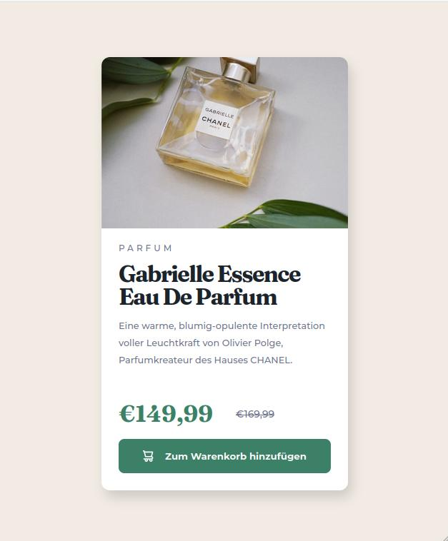

# Product Preview Card

### Challenge

Your challenge is to build out this product preview card component and get it looking as close to the design as possible.

You can use any tools you like to help you complete the challenge. So if you've got something you'd like to practice, feel free to give it a go.

Your users should be able to:

- View the optimal layout depending on their device's screen size
- See hover and focus states for interactive elements

 

### Screenshot 
Desktop
 
 

Mobile
 
 

#### [Live Site](https://orange-hill.github.io/product-preview-card/)

 

### Built with

- HTML
- CSS
- Flexbox

 

### Author

- [orange-hill](https://www.orange-hill.net)
- This is a solution to the ["Product Preview Card"](https://www.frontendmentor.io/challenges/product-preview-card-component-GO7UmttRfa) challenge on Frontend Mentor

